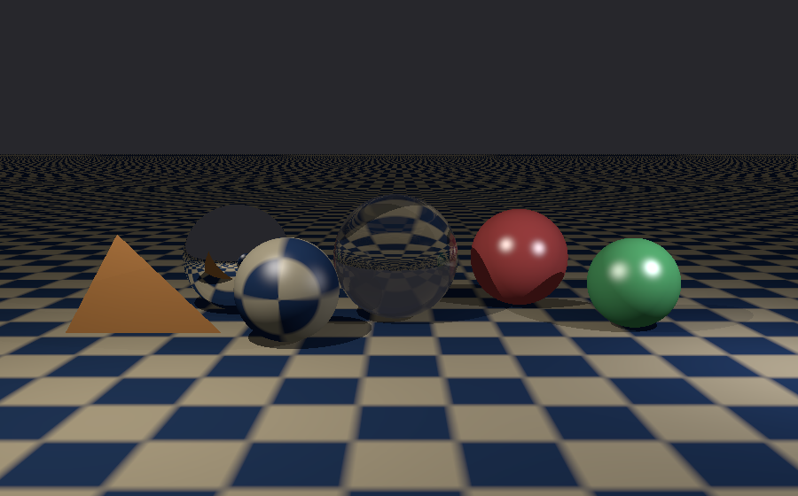
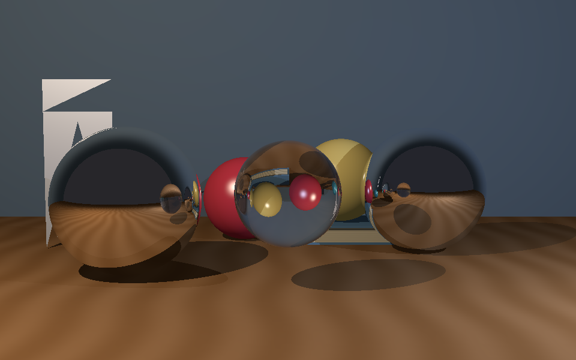
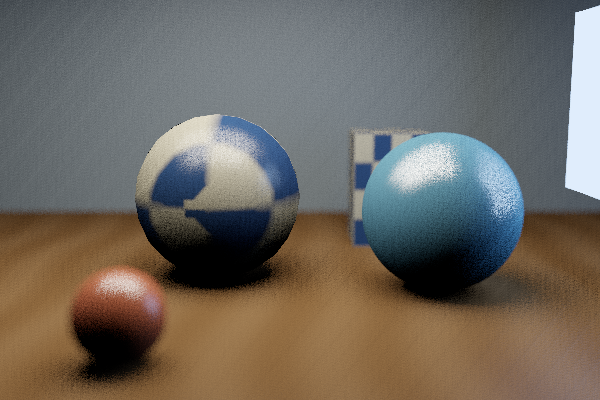
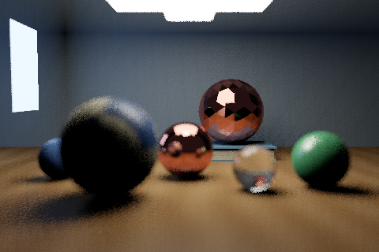

# Module 1：实现事实、验证证据与报告材料索引

本文件是代码/场景/日志的技术资料，不是可提交的报告正文。
报告章节和填写问题见 [module1-report-outline.md](module1-report-outline.md)。
依据 `CWSpec2026.pdf` §1.3，报告文字、讨论与图注由学生自行撰写；不能直接把
AI 回答或本资料中的解释复制为报告正文。代码及调试可以使用 AI，必须真实声明参与程度。

## 0. 范围与当前状态

| 项目 | 事实与来源 |
|---|---|
| 当前分支 | `module1`，修复、资产、文档仍是本地未提交改动 |
| 模块范围 | §2.1：WSRT 核心功能 + DRT 网格/纹理/面光源/BRDF/景深/tone mapping |
| 本阶段不要求 | Module 2 相机研究/AA 系列/采样器对比/BF-MD 研究；Module 3 BVH/PBRT 对比套件；Final importance sampling |
| 数学和功能检查 | 上次执行 `make check-module1`：50 checks，0 failures；源码 `tests/module1_checks.cpp` |
| 四张主图 | 均存在，同名日志均有成功写图和结束记录，0 parse warnings / 0 parse errors |
| 真实参考照片 | 尚未提供；两张 creative 均为临时桌面构图 |
| 报告与标注 | 尚需学生完成；没有生成 `reports/Module1.pdf` |
| PBRT-v4 差分验证 | 未进行；标准输入解析测试不等于与 PBRT 渲染一致 |

50 个针对性检查不证明任意输入都正确；图片美观也不能单独证明公式或能量守恒。
Module 1 的实现、证据与完整提交材料应分别核对。

## 1. 报告要求：需要准备什么

| 规范位置 | 需要的材料 | 学生自行完成的内容 |
|---|---|---|
| §2.1.1 | `WSRT_simple`、`WSRT_creative`；反射/折射/着色/灯/阴影/纹理/几何的证据 | 选定特性区域、箭头/放大框、本人图注 |
| §2.1.2 | `DRT_simple`、`DRT_creative`；网格/纹理/面光源/Phong/DoF/Reinhard 证据 | 区分噪声、模糊、半影和高光，说明实际参数 |
| §2.1 创意图要求 | 本人拍摄的真实场景照片，旁边放对应渲染 | 照片与场景的对应关系、构图来源；不是“最好有”，而是要求 |
| §3.1 | 设计决策、困难、测试、示例图、观察；适用时 prompt 开发 | 自己说明 What/How/Why/Proof；不要使用未做过的实验结论 |
| §3.2 | WSRT 各特性小节、DRT 各特性小节、PBRT compatibility、profiling | 保留规范的章节覆盖；无需虚构额外研究 |
| §1.3 | AI 使用透明记录 | 实际工具、代码生成/修复范围、学生真实参与程度 |
| §1.4 | `reports/Module1.pdf` 与可重现代码/场景/资产 | 导出 PDF、检查打包路径与实际文件一致 |
| §4 | 特性按输出证据与解释两方面评价 | 多放物体不能替代清楚的标注、验证和具体解释 |

§3.1 要求 concise，没有“绝对禁止代码”或“最多两行代码”的规定。
通常以简短公式、算法说明和关键图像区域为主；是否放极短代码片段由学生自行判断。
不需要把 `.cpp` 文件大段粘进报告，也没有本规范明确规定的固定页数。

## 2. 可核对的架构

```text
main.cpp
  ParseSceneFile() → Scene
  MakeIntegrator(scene.integrator)
  Render(scene) → Image
  WriteImage() → PNG/PPM + 同名日志

像素位置 → Camera::GenerateRay()
         → Radiance() / SampleRadiance()
         → IntersectScene()：最近命中
         → Material 与 Light：颜色/BRDF/照明
         → Occluded()：到灯之间是否有遮挡
```

| 对象/模块 | 实际责任 | 不能混淆的内容 |
|---|---|---|
| `Scene` | 持有 shapes/lights/materials/camera/film 与参数 | 不负责积分光照 |
| `Ray` | `o`、`d`、`tMax`；`p(t)=o+t*d` | 没有 `reflectivity` 成员；权重不存于 Ray |
| `SurfaceInteraction` | 交点 p、着色法线 n、几何法线 ng、UV、材质指针 | n 和 ng 的用途不完全相同 |
| `Shape` | 求交、表面记录、UV | 不直接计算材质亮度 |
| `Material` | 材质类型、参数、纹理、Blinn-Phong/Phong/Fresnel | 镜面球不通过 Phong 高光实现完整反射 |
| `Camera` | 透视/薄透镜射线；焦面与光圈采样 | 焦距是沿 forward 的距离，不是每条射线的固定长度 |
| `WhittedIntegrator` | 一条中心主射线，直接点光照，镜面/玻璃递归 | 实际函数是 `Radiance`，不是 `traceRay` |
| `DistributedIntegrator` | 多次 lens/light 采样并平均，直接 BRDF 光照和 delta 递归 | 当前没有漫反射间接光，也没有 BVH |
| `Logger` / `ScopeTimer` | 诊断与 render 计时 | 当前 parse/total timer 未在 Report 前结束，日志无有效 parse/total 阶段数据 |

### 向量与参数约定

| 名称 | 约定 |
|---|---|
| `ray.d` | 朝命中表面前进的方向 |
| `wo=-ray.d` | 从表面指向上一段路径/观察者 |
| `wi` | 从表面指向光源，两者均为向外方向 |
| `Reflect(wo,n)` | 输入/输出均是从表面向外的方向 |
| `ng` | 保持几何朝向，用于介质入口/出口判断及阴影偏移 |
| `n` | 面向 wo 的着色法线，用于光照/BRDF |
| `throughput` / `beta` | 路径权重，作为递归函数参数传递 |
| `RefractIncident` 的 eta | `etaI/etaT` |
| `FrDielectric` 的 eta 参数 | `etaT/etaI`；不要交换两个函数的比值约定 |
| t | 相机射线单位长度时为世界距离；变换到 object space 后保留同一参数 |

## 3. 四个场景的真实参数与已有计时

来源：`scenes/*.pbrt` 和当前 `output/*.log`，不是示例数字。

| Scene | 分辨率 | 实际主样本/像素 | MD | 基元数 | 灯数 | FOV | 光圈 | 焦距 | 本次 render time |
|---|---|---:|---:|---:|---:|---:|---:|---:|---:|
| WSRT_simple | 900×560 | 1 | 8 | 8 | 2 | 58° | 0 | — | 0.461692 s |
| WSRT_creative | 960×600 | 1 | 12 | 47 | 2 | 48° | 0 | — | 3.801205 s |
| DRT_simple | 600×400 | 32 | 4 | 336 | 2 | 46° | 0.18 | 9.0 | 66.585001 s |
| DRT_creative | 480×320 | 24 | 4 | 682 | 3 | 50° | 0.18 | 13.5 | 82.613686 s |

- WSRT 不使用解析日志中默认的 `spp=4`；看实际 `WSRT: ... 1 sample/pixel` 行。
- DRT 像素位置固定中心，spp 用于 lens/light 采样；不能称它已实现 Module 2 像素超采样。
- 两张 DRT 均为 per-channel extended Reinhard，white point = 8。
- 每个 area light 默认每次相机样本采 1 点；可通过 `"integer samples"` 另行配置。
- BF=4 是保留兼容字段，当前没有参与漫反射分支，不能据它声称每次散射发出四条漫反射路径。
- 最终两张 DRT 的这次计时来自同时启动的渲染；机器负载不受控。报告基线建议串行重测。
- render time 不含全部解析/写图时间；没有 BVH 构建时间，不要填写假的 0 或示例值。

### 环境（本次已核对）

| 项目 | 值 |
|---|---|
| OS | macOS 27.0.1，build 26A434 |
| CPU | Apple M2 Pro |
| Compiler | Apple clang 21.0.0，clang-2100.1.1.101，arm64 |
| 标准/优化 | `-std=c++17 -O3 -Wall -Wextra -Isource -fno-strict-aliasing` |
| 并行渲染 | renderer 单线程；`make -j4` 仅并行编译 |
| C++ 外部依赖 | 无；Python 标准库生成器仅用于可选资产重建 |

## 4. 特性事实卡：支持自己撰写各个小节

以下是实现事实、公式、测试和待回答的问题，不是可粘贴的设计理由或讨论正文。

<a id="f01"></a>
### F01：WSRT 镜面反射

- 入口：`source/core/vec.h::Reflect`；`whitted.cpp::Radiance` 镜面分支。
- 实际关系：`wo=-ray.d`；`Reflect(wo,ng)=-wo+2*dot(wo,ng)*ng`。
- 入射方向形式的等价公式：`dr=d-2*dot(d,ng)*ng`。
- 权重：下一段 `throughput *= mat->reflectance`；达到 MD 返回 `Color(0)`。
- 真正修复：原来传 `ray.d` 给使用向外约定的 Reflect；终止时又直接返回 throughput 造成虚假亮度。
- 证据：反射保留切向分量/反转法向分量；镜面平面看到 `(0.02,0.02,0.025)` 背景；深度终止贡献为零。
- 可标注：WSRT_simple 左后镜面球；WSRT_creative 两侧 chrome 球的物体/桌面倒影。
- 学生自己回答：为什么限制递归？当前反射率如何影响图像？不要编造“MD>3 提升很小”的实验结论。

<a id="f02"></a>
### F02：折射、Fresnel 与 TIR

- 入口：`RefractIncident`；`FrDielectric`；两个 integrator 的 dielectric 分支。
- Snell：`etaI*sin(thetaI)=etaT*sin(thetaT)`；`sin²(thetaT)=(etaI/etaT)²*(1-cos²(thetaI))`。
- TIR：`sin²(thetaT)>=1` 时不生成透射方向，Fresnel R=1。
- 介质判断：`entering = dot(ng,ray.d)<0`；先判断，再定向 faceNormal；假设物体处于空气中。
- 实际路径：反射权重 `reflectance*R`；透射权重 `reflectance*(1-R)*(etaI/etaT)²`。
- 真正修复：折射方向符号、翻转 ng 后无法区分出口、DRT 固定舍弃较弱 Fresnel 分支。
- 证据：air→glass 30°，透射正弦=1/3；1↔1.5 正入射 R=0.04；glass→air 60° TIR；出口介质与 eta 权重测试。
- 场景值：WSRT_simple glass eta=1.52；WSRT_creative glassSlab eta=1.60；DRT_creative paperweight eta=1.5。
- 学生自己回答：R/T 随角度如何变化？哪个区域证明折射？图片不能独自证明该区域发生 TIR。

<a id="f03"></a>
### F03：Blinn-Phong

- 入口：`Material::BlinnPhongSpecular`；WSRT 直接点光照循环。
- Ambient：`baseColor*ambientScale`；diffuse：`baseColor/pi * max(0,n·wi)*I/r²`。
- 高光：`h=normalize(wo+wi)`；`specular*max(0,n·h)^shininess`，随后乘光源量。
- 真实参数：WSRT_simple 红球 kd=(0.65,0.10,0.10)，ks=(0.9,0.9,0.9)，shininess=120；绿球 shininess=60。
- 真正修复：Material 类型 token 吞掉第一个 reflectance 参数；Blinn-Phong 类型被统一解析为 Phong。
- 可标注：红/绿球亮斑；镜子上的整幅倒影不是这一高光模型的证据。
- 学生自己回答：半角向量是什么？指数为什么影响亮斑宽度？若比较指数，保持场景其它条件不变。

<a id="f04"></a>
### F04：点光源与阴影

- 入口：`PointLight`；`Occluded`；`whitted.cpp` 的 shadowRay。
- 位置/强度：WSRT_simple key=(-3.5,5.5,5)，I=(55,52,48)；fill=(4.5,3,3.5)，I=(18,18,20)。
- 光照衰减：`I/r²`；shadow ray 最大距离 `dist-2*eps`，不包含光源后面的遮挡物。
- 阴影起点：`p+oriented_ng*eps`，`eps=1e-4*max(1,dist)`；注意镜面/折射路径采用 `p+d*1e-4`。
- 证据：rho=0.5、I=4、r=2、正入射，无 ambient/specular 时 L=0.5/pi；加入段内遮挡物后 L=0。
- 可标注：三角形/球体在棋盘平面上的硬阴影。
- 学生自己回答：为什么做有限段查询？为什么偏移？不能把所有射线的偏移都描述成同一法线公式。

<a id="f05"></a>
### F05：纹理与 UV

- 入口：`Sphere::UV`、`Plane::UV`、`Triangle::Intersect`、`LoadTexturePPM`、`TextureLookup`。
- 球面：`u=phi/(2*pi)`，phi=atan2(n.y,n.x)；`v=acos(clamp(n.z,-1,1))/pi`。
- 平面：局部 UV=(0.5*x,0.5*y)；三角形 UV=三顶点 UV 的重心加权和。
- 纹理：P3/P6，maxval=255；加载后 sRGB→linear；双线性采样；支持 scale 和 wrap。
- 真实文件：broad_checker 32×32；wood 64×64；paper 32×32；均为程序生成 P3。
- 真正修复：非标准球面参数化；Black wrap 原先将域内 texel 也当成黑色。
- 可标注：WSRT_simple 左前棋盘球/地板；粗棋盘减少频率，但不等于实现了 antialiasing。
- 学生自己回答：UV 如何从表面点产生？粗纹理为何更容易看清？不要把木纹资产称为真实照片。

<a id="f06"></a>
### F06：几何、变换与最近交点

- 入口：`shape.cpp`；`TransformRay`、`TransformNormal`；`IntersectScene`。
- 球：解 `a*t²+b*t+c=0`，取最小正解；平面局部 z=0，`t=-oz/dz`。
- 三角形：Möller–Trumbore；重心权重>=0 且和为1；用于 UV/法线插值。
- 变换：射线起点用逆点变换，方向用逆线性变换，**不再次归一化**；法线用 inverse transpose 并归一化。
- 真正修复：缩放后归一化方向使 object-space t 和 world-space t 不可比较；普通矩阵变换法线破坏垂直关系。
- 证据：半径1球缩放2，o=(0,0,5)、d=(0,0,-1)，命中 t=3、世界点 z=2；旋转/非均匀缩放后法线仍垂直切线。
- 实际结构：线性遍历所有 primitives；最近命中记录材质、UV、n/ng，没有 BVH。
- 学生自己回答：为什么必须比较一致的 t？为什么选最近正交点？

<a id="f07"></a>
### F07：OBJ 网格与平滑法线

- 入口：`LoadOBJ`、`TriangleMesh::RecomputeNormals`、`BuildTriangles`、`Triangle::Intersect`。
- 格式：v/vt/vn/f；支持 v/vt/vn 三元组、缺失字段、负索引；多边形扇形三角化。
- 法线：无 vn 时对相邻面的未归一化叉积进行面积加权，再归一化；为各 face corner 赋正确 vn 索引。
- 变换：网格顶点预先变到 world space；显式顶点法线同样按 inverse transpose 变换。
- 当前资产：uv_geodesic=162 vertices、320 faces、960 vt、162 vn；box=24 vertices、12 faces、4 vt、6 vn。
- 真正修复：生成法线却未按顶点引用；网格 transform 被忽略；旧报告网格没有 vt，无法展示纹理。
- 可标注：DRT_simple 左侧棋盘球与后方盒，均是 OBJ；DRT_creative 书上镜面网格也是 OBJ。
- 学生自己回答：平滑着色与几何轮廓为何不同？不能仅凭多面体外观证明 OBJ loader 正确。

<a id="f08"></a>
### F08：网格纹理

- 入口：`Triangle::Intersect` 的 UV 插值；DRT baseColor；`Material::F(...,baseColor)`。
- 计算：`baseColor=DiffuseColor()*TextureAt(hit.uv)`；传入 BRDF 决定 diffuse 系数。
- 接缝：生成器对跨 longitude seam 的三角形局部展开 u，纹理以 Repeat 方式读取。
- 证据：主资产 vt/vn 存在且各 corner 引用有效；black texel 使 diffuse BRDF=0。
- 推荐放大区域：DRT_simple 左球的蓝/米色棋盘边界；背景盒正面作为额外平面网格 UV 证据。
- 学生自己回答：为什么仅声明 texture 文件不够？n 插值和 UV 插值分别影响什么？

<a id="f09"></a>
### F09：面光源、采样与软阴影

- 入口：`AreaLight::SamplePoint/Area/IntersectRay`；DRT direct-light 循环；`core/sampler.h/.cpp`。
- 当前策略：PCG32 伪随机均匀采样，不是 Grid/Halton，也不是分层采样。
- 矩形：局部 `(2u-1,2v-1,0)` 变到 world space；场景使用四个明确角点。
- 概率：area PDF=1/A；solid-angle PDF=`r²/(cosLight*A)`。
- 单样本贡献：`f*cosSurface*Le/pdfLight*beta`；除以每灯 samples；相机样本再除以 spp。
- DRT_simple：softbox 面积25.2、Le=(10,9.5,8.5)；侧灯面积5.75、Le=(2.5,4,7)。
- DRT_creative：key/spec/rim 面积15.84/1/5.2；Le=(12,11.5,10)/(30,29,27)/(4,6,10)。
- 真正修复：矩形坐标系行/列混用；采样法线没变到世界空间；改用独立 lens/light 样本。
- 可标注：地面上物体投影由暗到亮的半影边缘；面板本身只是 emitter 可见性，不是软阴影。
- 学生自己回答：部分光源可见如何产生半影？采样噪声和物理软阴影如何区分？

<a id="f10"></a>
### F10：Phong BRDF 与能量

- 入口：`source/scene/material.cpp::Material::F`；DRT 调用处另乘 cosSurface。
- 计算：`ks=clamp(specular,0,1)`；`kd=clamp(texturedDiffuse,0,1)*(1-ks)`。
- BRDF：`kd/pi + ks*(e+2)/(2*pi)*max(0,Reflect(wi,n)·wo)^e`。
- 支持半球：n·wi>0 且 n·wo>0；cosSurface 在 integrator 中乘一次，不重复放进 diffuse BRDF。
- DRT_simple 左网格 ks=0.12、e=40；蓝球 ks=0.35、e=60；红前景 ks=0.2、e=45。
- 真正修复：仅归一化 lobe 但未限制 diffuse+specular 能量；纹理没进入实际 BRDF。
- 证据：rho=1、ks=0.8、e=20，256×256 半球数值积分，在观察角0°/45°/80°检查能量<=1.0001。
- 学生自己回答：lobe normalization 与总能量预算分别解决什么？亮斑不是能量守恒证明。

<a id="f11"></a>
### F11：景深与薄透镜

- 入口：`Camera::GenerateRay`；DRT `Render`。
- 光圈采样：`r=lensRadius*sqrt(u)`、`theta=2*pi*v`，映射到圆盘后改变 ray origin。
- 焦面：`tf=focusDistance/(dir·forward)`；`focusPoint=position+dir*tf`。
- 下一射线：`normalize(focusPoint-lensOrigin)`；同一像素的不同镜头起点朝相同焦面点。
- 真正修复：原先每条 ray 沿自身方向走同样距离，产生球面焦点集合而非平面。
- 证据：非中心像素、不同 lens samples 与 D=10 焦面交点一致；相机 up 向量也已验证。
- 主图参数：simple A=0.18、D=9、spp=32；creative A=0.18、D=13.5、spp=24。
- 可标注：simple 前方小红球、左侧纹理网格、后方盒；creative 左侧前景网格和书上后景。
- 学生自己回答：离焦与 sampling noise 的区别？A=0 时应怎样？目前没有闭合光圈参考图，不能声称已测过光圈 sweep。

<a id="f12"></a>
### F12：Reinhard 与输出编码

- 入口：`ToneMapReinhard`；DRT `Render`；`WriteImage`/`LinearToSRGB`。
- 实际顺序：先平均 HDR samples → extended Reinhard → clamp [0,1] → film → 写图时 sRGB 编码。
- 两张 DRT：逐 RGB 通道映射，W=8；luminance 模式也有实现，但不是这两张主图使用的模式。
- 公式：`c' = c*(1+c/W²)/(1+c)`；luminance 模式用 mappedY/Y 缩放 RGB。
- 证据：c=W=4 映射为1；W=1 时严格恒等。
- 当前图像 max：DRT_simple=0.973973；DRT_creative=1.000000。这不提供 clipped pixels 数量，也不证明完全无裁剪。
- 学生自己回答：tone mapping 与 gamma/sRGB 有何不同？不能写“窗户不死白所以算法正确”。

## 5. 图片索引与标注候选

位置描述用于找到区域，不是替学生撰写的图注；应按最终图片自行画箭头/放大框。

### WSRT_simple



| 位置 | 对象名 | 候选证据 |
|---|---|---|
| 左侧橙色三角形 | triA/triB | 单独三角形几何、直接光照 |
| 左后球 | mirrorSphere | 桌面/物体的镜面倒影 |
| 左前蓝/米色球 | texturedSphere | 球面 UV 棋盘纹理 |
| 中间透明球 | glassSphere | 折射后改变的背景图案 |
| 右側红/绿球 | redSphere/greenSphere | Blinn-Phong 高光与材质颜色 |
| 地板投影与棋盘 | ground | 硬阴影、平面 UV；地板是 diffuse，非镜面 |

### WSRT_creative：临时桌面构图



候选：chromeLeft/chromeRight 倒影；中央 slab 封闭玻璃椭球；bookPages/bookTop/
bookBottom 书本；floor 木纹；archL/archR/archTop 三角形装饰。
真实参考照片、与照片的关联说明和图注尚缺。

### DRT_simple



候选：左侧 ico 棋盘 OBJ 网格；前方 foreground 小红球；右侧 ball Phong 球；
后方 checkerBlock OBJ 盒；地板投影半影；右边可见 bounce 发光面板。
严格景深验证仍可补同场景 pinhole 参考；当前模糊判断与数学汇聚测试应分别说明。

### DRT_creative：临时桌面构图



候选：nearMesh 前景离焦棋盘网格；farMesh 书本上的镜面网格；mirrorBall 倒影；
glassPaperweight 玻璃镇纸；greenBall 高光；bookPages 的纸纹；物体投影半影。
左侧/上方白色矩形是发光面板，不能直接标成“窗户投射的软阴影”。
近处纹理因刻意离焦不易辨认，应以 DRT_simple 作为清晰网格纹理的主要证据。

## 6. PBRT 子集与错误处理材料

| 项目 | 当前事实 |
|---|---|
| 标准语法 | Film/Sampler/Integrator/LookAt/Camera/WorldBegin/End、Material/NamedMaterial、PPM imagemap Texture、point LightSource、diffuse AreaLightSource、sphere/inline trianglemesh、Translate/Scale/Rotate、AttributeBegin/End |
| 项目 block 格式 | 继续支持 named、brace-delimited 场景；OBJ 文件由此路径加载 |
| 标准 FOV | 较小图像轴；legacy block 较大图像轴；不能不说明差异 |
| Transform 顺序 | `xf=xf*op`，最后出现的 transform 先作用于点 |
| 资产路径 | 相对于 `.pbrt` 所在目录解析 |
| 诊断 fixture | `tests/fixtures/broken.pbrt`：缺失纹理、未知 capsule、未支持 Object |
| 标准 fixture | `tests/fixtures/standard.pbrt`：标准语法、scope、named texture、trianglemesh 数组、点灯/面灯 |
| 已记录诊断 | 缺失纹理/未知形状写 ERROR；unsupported Object 写 WARN；可以继续输出背景或已解析部分 |
| 未支持/近似 | Includes、一般实例、动画、完整相机 transform stack；标准 path 明确告警并近似为直接光 DRT |
| area-source 限制 | 显式采样 sphere/四角 mesh；非矩形 mesh emitter 可见但没有一般面积采样实现 |
| 光学限制 | 无嵌套介质栈；无漫反射间接光；球形 emitter 不支持非均匀缩放 |

自包含错误场景的成功退出只说明 graceful handling，不说明“没有错误”。
若与 PBRT 比较，必须记录实际 PBRT 版本、对应输入、参数、像素/指标；当前还没有这些差分数据。

## 7. 已做的检查与真实修复记录

| 项目 | 原问题 | 当前核验 |
|---|---|---|
| Mirror | ray.d/wo 符号混用 | 解析反射分量 + 实际镜面路径 |
| Depth termination | 返回 throughput 作为亮度 | 深度上限返回0 |
| Glass | 折射符号与出口判断错误；DRT 舍弃分支 | Snell、Fresnel、TIR、进出介质权重 |
| Transform | object-space ray 重新归一化 | 缩放 sphere/plane/triangle 的世界 t |
| Normals | 普通矩阵变换；网格索引/变换遗漏 | 垂直性/单位长度，vn 与角点索引 |
| Material parsing | 首个 reflectance 被吞掉 | 精确检查 (0.2,0.3,0.4)、Blinn 类型、phong exponent=23 |
| Mesh texture | 旧资产无 vt、BRDF 没用 textured colour | 新资产 vt/vn 引用有效；黑 texel diffuse=0 |
| Rect emitter | 行/列坐标系混用、世界 normal 遗漏 | 四角、面积、PDF、变换、samples 参数 |
| Lens | 固定 ray 长度焦点 | 不同镜头起点交同一平面焦点 |
| BRDF | lobe normalization 不等于总能量约束 | per-channel 预算 + 三个观察角积分 |
| Black wrap | 域内也被置黑 | 域内颜色保留，域外黑色 |
| 输入兼容 | 仅自定义 block 格式 | 新增标准 PBRT 解析 fixture |

这些修复/检查由本次 AI coding agent 工作完成；学生的人工贡献要按实际情况声明，
不能把它们写成“我手动改了这些代码”而没有真实参与。
可使用自己实际发过的请求作为 prompt 记录，但不得编造工具名称或参与比例。

## 8. 核验命令与日志字段

```sh
make
make check-module1
./renderReportedImages.sh

# 可选：已包含的程序资产重建，不是 renderer 的运行依赖
python3 scripts/generateModule1Assets.py
```

| 字段 | 应如何解读 |
|---|---|
| `parsed scene: ... shapes` | 展开网格后基元数，不是场景 Shape block 数 |
| `WSRT: ... 1 sample/pixel` | 实际 WSRT 主射线数 |
| `DRT: ... spp=... lensRadius=... focus=...` | 本次 DRT 参数 |
| `frame time: ... s` | render 阶段耗时 |
| `wrote ... (WxH)` + finished | 本次成功结束，不要把旧 PNG 当成本次成功输出 |
| `parse warnings=N parse errors=N` | 解析期间的诊断数；不一定包含解析结束后发出的 warning |
| `image mean/min/max/stddev` | film 统计：DRT 已 tone-map/clamp，尚未 sRGB；不是 raw HDR |

当前只有 render 阶段完整报告。规范 §2.1 的 parsing/BVH/shading 分阶段计时是可选的。
若需要 total/parse 数值，应先修正计时器生命周期再测量；不能补示例数字充当结果。
图像全局 stddev 同时受内容/纹理/光照影响，不能直接当作 estimator variance。

## 9. 对外来写作指南的逐项纠正

| 指南说法 | 当前核对 |
|---|---|
| 绝对不能放代码；最多1–2行 | 规范没有这个硬性限制，只有 concise 和解释要求 |
| MAX_DEPTH=5、traceRay、reflectivity 传给 Ray | 与本代码不符；看本文件 MD、Radiance、throughput/beta |
| 透明球就是镜面反射球 | 区分镜面、折射和 Fresnel 反射，不混用对象 |
| 棋盘地板有镜面倒影 | WSRT 地板为 diffuse，反射图案主要在镜面/玻璃球内 |
| 玻璃内某个亮区域必然是 TIR | 未做该像素路径诊断，不能作此断言 |
| 只要高光自然，就证明 Reinhard 防止过曝 | 代码/数学测试才是公式证据；面板仍可能裁剪到1 |
| 看到粗多面体才算 mesh | 带平滑法线的圆球也可以是 OBJ mesh；左侧棋盘网格就是例子 |
| 发光窗户的亮区域就是 soft shadow | 发光面板、照明分布、物体遮挡半影是不同概念 |
| 深度超过3收益微小、时间指数增长 | 没有该 sweep 数据；单分支镜面路径不必指数增长，玻璃双分支才可能快速增长 |
| Module 1 必须列 BVH build time | BVH 属 Module 3；本分支未实现，不能捏造计时 |
| 最好拍一张照片 | 创意图真实照片是明确要求，当前欠缺 |
| 可以保证高分 | 不能；规范也考察学生自己的解释、图片标注、验证和提交完整性 |

## 10. 仍需学生自己完成

- [ ] 两张 creative 的真实照片及场景对应关系。
- [ ] 四张最终图的本人图注、箭头/放大框。
- [ ] 各小节的具体设计理由、困难、观察，不复制示例段落。
- [ ] 在需要因果结论时补控制变量对照（例如 aperture=0、改变 samples/MD）；目前不能声称做过。
- [ ] 串行基线计时和明确的机器/参数记录。
- [ ] 真实的 AI 使用范围与本人参与说明。
- [ ] `reports/Module1.pdf`，以及规范指定的目录/资产打包。

建议先用 [outline](module1-report-outline.md) 覆盖 §3.2 章节，再从本文件查找事实，
最终仅保留学生自己理解、验证和撰写的解释，而不是提交这份资料索引。
